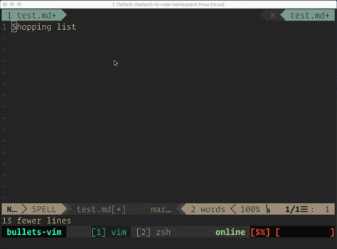
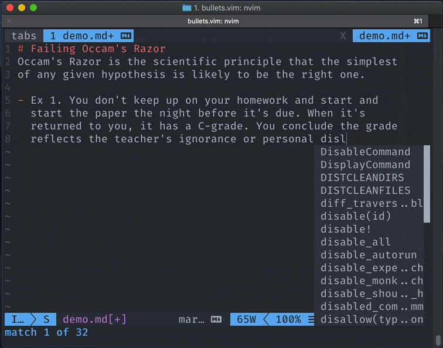
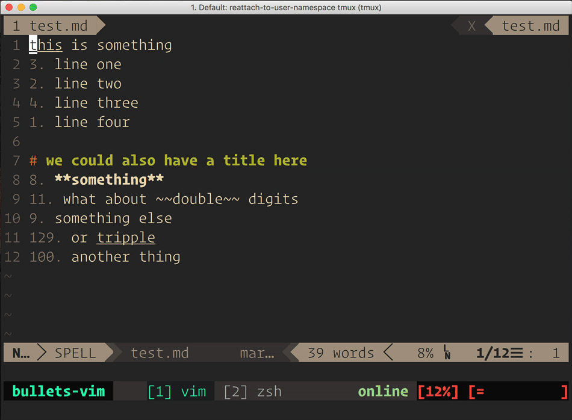

[](https://travis-ci.org/dkarter/bullets.vim)

# Description

Bullets.vim is a Vim plugin for automated bullet lists.

Simple bullets:



Wrapped text bullets:


Renumbering lines:


# Installation

With VimPlug:

```vim
Plug 'dkarter/bullets.vim'
```

Then source your bundle file and run `:PlugInstall`.


# Usage

In markdown or a text file start a bulleted list using `-` or `*`. Press return
to go to the next line, a new list item will be created.

# Configuration

You can choose which file types this plugin will work on:

```vim
" Bullets.vim
let g:bullets_enabled_file_types = [
    \ 'markdown',
    \ 'text',
    \ 'gitcommit',
    \ 'scratch'
    \]
```

Just add above to your .vimrc

# Documentation

```
:h bullets
```

# Testing

The test suite is written using vimrunner. It is known to run on macOS with MacVim installed, and on travis. Your vim must have `+clientserver` and either have its own GUI or in a virtual X11 window.

On your mac run:

```sh
bundle install
bundle exec rspec
```

On linux:

```sh
bundle install
xvfb-run bundle exec rspec
```

You should see a Vim window open which will run each test, same general idea as
Capybara integration testing. ❤️

# TODO

- [x] eliminate trailing bullet on previous line if user pressed <cr> twice
- [x] allow indenting while in insert mode (C-l: indent right, C-h: indent left)
- [x] scope the keybindings and functions to markdown and perhaps text
- [x] allow GFM-style checkbox auto bullet
- [x] prefix shortcuts and allow disabling them
- [x] add numbered list
- [x] reset numbers (user selects numbered bullets 3-5 and copies to middle of document, then reselects and resets them to 1-3)
- [x] check if plugin initialized and don't load if it did
- [x] allow <C-cr> for return without creating a bullet (only possible in GuiVim
  unfortunately)
- [x] check if user is at EOL before appending auto-bullet - they may just want to
- [x] attempt to keep the same total bullet width even as number width varies (right padding)
- [x] detect lists that have multiline bullets (should have no empty lines between
  lines).
- [x] add alphabetic list
- [x] support for intelligent alphanumeric indented bullets e.g. 1. \t a. \t 1.
- [ ] update documentation for nested bullets
- [ ] support for nested numerical bullets, e.g., 1. -> 1.1 -> 1.1.1, 1.1.2
- [ ] change nested outline levels in visual mode
- [ ] support renumbering of alphabetical, roman numerals, and nested lists
- [ ] add option to turn non-bullet lines into new bullets with `C-t`/`>>`

---

### About

[](https://hashrocket.com)

Bullets.vim is kindly supported by [Hashrocket, a multidisciplinary design and
development consultancy](https://hashrocket.com). If you'd like to [work with
us](https://hashrocket.com/contact-us/hire-us) or [join our
team](https://hashrocket.com/contact-us/jobs), don't hesitate to get in touch.
